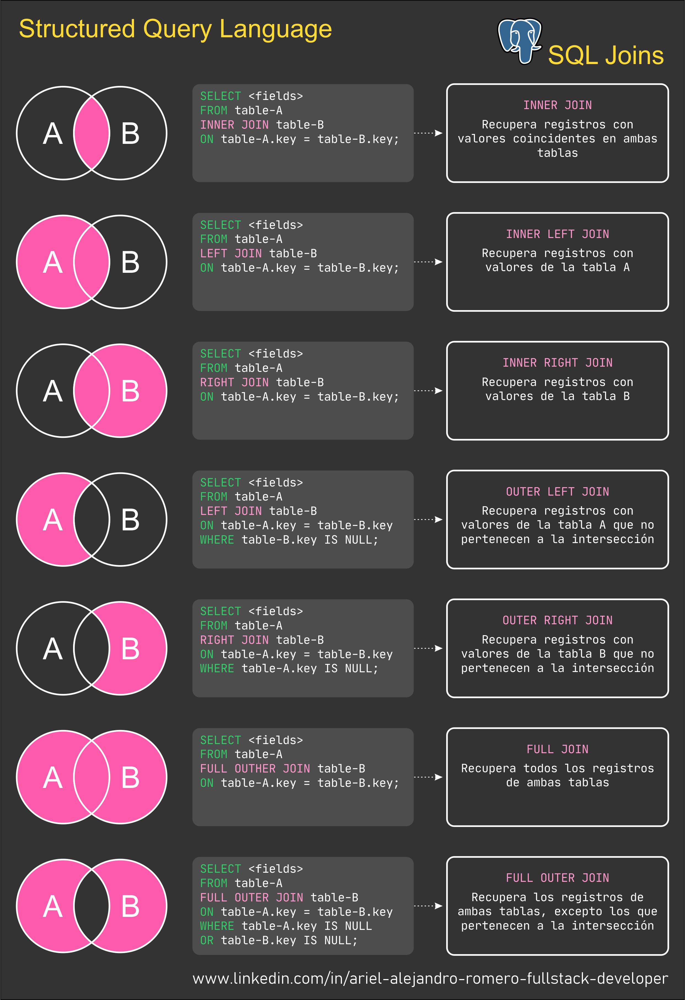

# M3-04 Fundamentos SQL

[Volver a Inicio](../README.md)

## Links

- [PostgreSQL - Documentación](https://www.postgresql.org/)
- [PostgreSQL - Descargas](https://www.postgresql.org/download/)
- [SQL - Tutorial & Cheat Sheet](https://www.sqltutorial.org/sql-cheat-sheet/)
- [SQL - W3Schools](https://www.w3schools.com/sql/)
- [LucidChart - Crear Diagrama Entigad Relación](https://www.lucidchart.com)

## Comandos útiles en "psql"

### \l - Listar bases de datos

Descripción: Muestra una lista de todas las bases de datos en el servidor.
Ejemplo:

```sql
\l
```

### \conninfo - Información de conexión

Descripción: Muestra la información de la conexión actual.
Ejemplo:

```sql
\conninfo
```

### \q - Salir de psql

Descripción: Cierra la sesión de psql y te devuelve al shell del sistema operativo.
Ejemplo:

```sql
\q
```

### \? - Ayuda general

Descripción: Muestra una lista de todos los comandos de psql.
Ejemplo:

```sql
\?
```

### \h - Ayuda sobre comandos SQL

Descripción: Muestra la sintaxis de un comando SQL.
Ejemplo:

\h SELECT

### \x - Expandir el formato de salida

Descripción: Alterna entre el formato de salida estándar y el formato expandido, útil para ver registros con muchas columnas.
Ejemplo:

```sql
\x
```

### \c - Conectar a una base de datos

Descripción: Cambia la conexión a otra base de datos.
Ejemplo:

```sql
\c nombre_de_la_base_de_datos
```

### \dt - Listar tablas

Descripción: Muestra una lista de todas las tablas en el esquema actual.
Ejemplo:

```sql
\dt
```

## Resumen de Comandos SQL para PostgreSQL

### Crear una tabla

```sql
CREATE TABLE empleados (
    id SERIAL PRIMARY KEY,
    nombre VARCHAR(100) NOT NULL,
    departamento_id INTEGER
);
```

### Insertar datos en una tabla

```sql
INSERT INTO empleados (nombre, departamento_id) VALUES ('Homero Simpson', 1);
```

### Seleccionar todos los datos de una tabla

```sql
SELECT * FROM empleados;
```

### Actualizar datos en una tabla

```sql
UPDATE empleados SET nombre = 'Juana Pérez' WHERE id = 1;
```

### Borrar datos de una tabla

```sql
DELETE FROM empleados WHERE id = 1;
```

### Alterar una tabla para añadir una columna

```sql
ALTER TABLE empleados ADD COLUMN email VARCHAR(100);
```

### Alterar una tabla para modificar una columna

```sql
ALTER TABLE empleados ALTER COLUMN nombre SET NOT NULL;
```

### Eliminar una tabla

```sql
DROP TABLE empleados;
```

### Seleccionar datos con condiciones

SELECT \* FROM empleados WHERE departamento_id = 1;

### Seleccionar datos con orden

```sql
SELECT * FROM empleados ORDER BY nombre DESC;
```

### Crear una clave foránea

```sql
ALTER TABLE empleados
ADD CONSTRAINT fk_departamento
FOREIGN KEY (departamento_id) REFERENCES departamentos(id);
```

### Crear una tabla con clave foránea

```sql
CREATE TABLE departamentos (
    id SERIAL PRIMARY KEY,
    nombre VARCHAR(100) NOT NULL
);

CREATE TABLE empleados (
    id SERIAL PRIMARY KEY,
    nombre VARCHAR(100) NOT NULL,
    departamento_id INTEGER REFERENCES departamentos(id)
);
```

## JOIN


