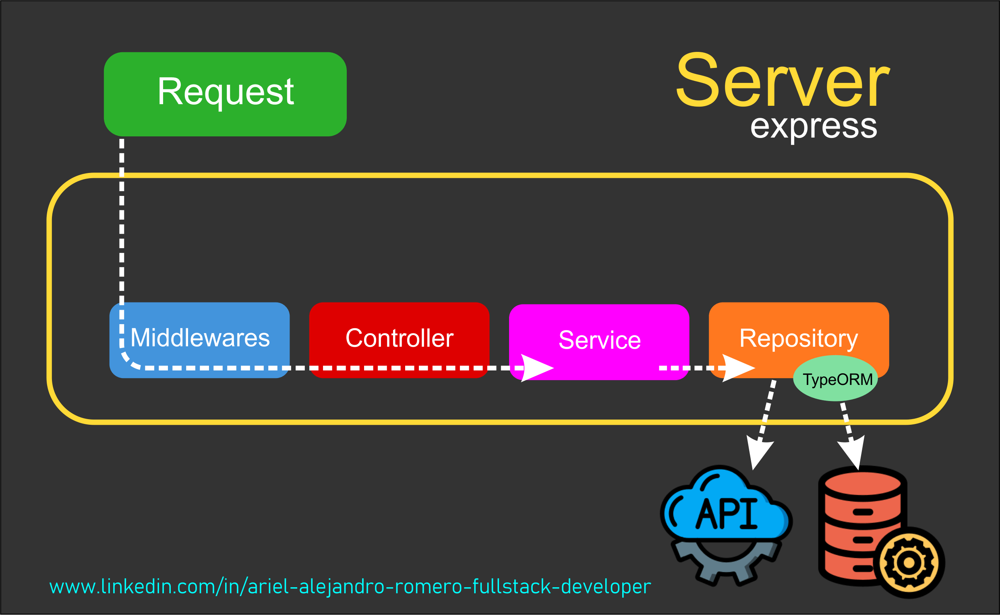

# M3-06 TypeORM II

[Volver a Inicio](../README.md)

## Links

[EntityManager API - TypeORM](https://typeorm.io/entity-manager-api)

[Repository APIs - TypeORM](https://typeorm.io/repository-api)

[Query Builder - TypeORM](https://typeorm.io/select-query-builder)

## Transacciones

Todas las operaciones en una transacción se completan correctamente o ninguna de ellas se aplica, asegurando la consistencia de los datos.
**Características de las Transacciones**:

1. **Atomicidad**: Todas las operaciones dentro de la transacción se consideran como una única unidad de trabajo. Si alguna operación falla, todas las operaciones se revierten.
2. **Consistencia**: La base de datos pasa de un estado consistente a otro estado consistente después de la transacción.
3. **Aislamiento**: Las operaciones dentro de una transacción son aisladas de las operaciones en otras transacciones.
4. **Durabilidad**: Una vez que una transacción se ha confirmado (commit), los cambios se guardan permanentemente en la base de datos.

### Niveles de Aislamiento de Transacciones

🎯El nivel de aislamiento es un concepto clave en el manejo de transacciones en bases de datos. Define la forma en que las transacciones se comportan respecto a la visibilidad de los cambios realizadas por otras transacciones concurrentes. Los niveles de aislamiento son importantes porque pueden afectar tanto el rendimiento como la consistencia de los datos en un sistema de base de datos.

🎯Existen cuatro niveles de aislamiento estándar, definidos por el SQL estándar y soportados por la mayoría de los sistemas de gestión de bases de datos (DBMS).

1. Read Uncommitted (Lectura No Confirmada)
   - **Descripción**: Las transacciones pueden leer datos que han sido modificados pero no confirmados (committed) por otras transacciones.
   - **Ventajas**: Mayor rendimiento debido a menor cantidad de bloqueos.
   - **Desventajas**: Posibilidad de lecturas sucias (dirty reads), donde una transacción puede ver datos no confirmados de otra transacción que podría ser revertida posteriormente.
   - **Problemas**:
     - **Dirty Reads**: Lectura de datos no confirmados.
     - **Non-Repeatable Reads**: Un valor leído puede cambiar si otra transacción lo modifica y confirma.
     - **Phantom Reads**: Nuevas filas pueden aparecer si otra transacción las inserta y confirma.
2. Read Committed (Lectura Confirmada)
   - **Descripción**: Las transacciones solo pueden leer datos que han sido confirmados por otras transacciones. Cada lectura dentro de una transacción puede ver cambios confirmados por otras transacciones.
   - **Ventajas**: Evita lecturas sucias.
   - **Desventajas**: Aún permite lecturas no repetibles.
   - **Problemas**:
     - **Non-Repeatable Reads**: Un valor leído puede cambiar si otra transacción lo modifica y confirma.
     - **Phantom Reads**: Nuevas filas pueden aparecer si otra transacción las inserta y confirma.
3. Repeatable Read (Lectura Repetible)
   - **Descripción**: Las transacciones garantizan que si leen un valor, ninguna otra transacción puede modificar ese valor hasta que la transacción inicial sea confirmada o revertida. Sin embargo, otras transacciones pueden insertar nuevas filas que no serán vistas hasta que la transacción actual finalice.
   - **Ventajas**: Evita lecturas sucias y lecturas no repetibles.
   - **Desventajas**: Mayor uso de bloqueos, lo que puede afectar el rendimiento.
   - **Problemas**:
     - **Phantom Reads**: Nuevas filas pueden aparecer si otra transacción las inserta y confirma.
4. Serializable (Serializable)
   - **Descripción**: El nivel de aislamiento más estricto. Las transacciones se ejecutan de manera que parece que fueron ejecutadas secuencialmente, una tras otra, en lugar de concurrentemente. Evita todas las posibles anomalías de concurrencia.
   - **Ventajas**: Máxima consistencia de datos.
   - **Desventajas**: Peor rendimiento debido a la mayor cantidad de bloqueos y a la necesidad de manejar conflictos.
   - **Problemas**: Ninguna de las anomalías descritas es posible en este nivel.

#### Problemas de Concurrencia

1. Dirty Reads (Lecturas Sucias): Ocurren cuando una transacción lee datos que han sido modificados por otra transacción que aún no se ha confirmado. Si la transacción que hizo los cambios se revierte, la transacción que leyó los datos verá información incorrecta.
2. Non-Repeatable Reads (Lecturas No Repetibles): Suceden cuando una transacción lee el mismo dato más de una vez y obtiene diferentes valores cada vez debido a que otra transacción ha modificado y confirmado los datos entre las lecturas.
3. Phantom Reads (Lecturas Fantasma): Se producen cuando una transacción obtiene diferentes resultados al ejecutar la misma consulta varias veces, porque otra transacción ha insertado, modificado o eliminado filas que coinciden con la condición de la consulta.

## Repositorios

### Flow del HTTP Request



### AppDataSource.manager Vs Repository

```ts
// Utilizando "AppDataSource.manager" => TODOS LOS REPOSITORIOS:
const videogames = await AppDataSource.manager.find(Videogame);

// Utilizando un "Repositorio":
const videogameRepository = AppDataSource.getRepository(Videogame);
const videogames = await videogameRepository.find();
```

## Subscribers y Entity Listeners

### 🎯1. Subscribers

- Un **Subscriber** en TypeORM es una clase que escucha a ciertos eventos de la base de datos y ejecuta acciones específicas cuando esos eventos ocurren.
- Los subscribers se utilizan para agregar lógica personalizada que se ejecuta automáticamente en respuesta a eventos como la inserción, actualización, eliminación y carga de entidades.

#### ➡️Tipos de Eventos en TypeORM

Los subscribers pueden escuchar los siguientes tipos de eventos:

- `beforeInsert`: Se ejecuta antes de que una entidad se inserte en la base de datos.
- `afterInsert`: Se ejecuta después de que una entidad se haya insertado en la base de datos.
- `beforeUpdate`: Se ejecuta antes de que una entidad se actualice en la base de datos.
- `afterUpdate`: Se ejecuta después de que una entidad se haya actualizado en la base de datos.
- `beforeRemove`: Se ejecuta antes de que una entidad se elimine de la base de datos.
- `afterRemove`: Se ejecuta después de que una entidad se haya eliminado de la base de datos.
- `beforeSoftRemove`: Se ejecuta antes de que una entidad se elimine de forma suave.
- `afterSoftRemove`: Se ejecuta después de que una entidad se haya eliminado de forma suave.
- `beforeRecover`: Se ejecuta antes de que una entidad se recupere de una eliminación suave.
- `afterRecover`: Se ejecuta después de que una entidad se haya recuperado de una eliminación suave.
- `afterLoad`: Se ejecuta después de que una entidad se haya cargado desde la base de datos.

### 🎯2. Entity Listeners

- Son métodos dentro de las clases de entidad que se ejecutan en respuesta a eventos específicos del ciclo de vida de la entidad, como antes o después de insertar, actualizar o eliminar registros.
- Estos listeners permiten ejecutar lógica personalizada en momentos clave del ciclo de vida de la entidad.

#### ➡️Eventos de Ciclo de Vida

Los eventos de ciclo de vida que se pueden capturar con entity listeners en TypeORM incluyen:

- `@BeforeInsert`: Se ejecuta antes de que una nueva entidad sea insertada en la base de datos.
- `@AfterInsert`: Se ejecuta después de que una nueva entidad ha sido insertada en la base de datos.
- `@BeforeUpdate`: Se ejecuta antes de que una entidad existente sea actualizada en la base de datos.
- `@AfterUpdate`: Se ejecuta después de que una entidad existente ha sido actualizada en la base de datos.
- `@BeforeRemove`: Se ejecuta antes de que una entidad sea eliminada de la base de datos.
- `@AfterRemove`: Se ejecuta después de que una entidad ha sido eliminada de la base de datos.
- `@AfterLoad`: Se ejecuta después de que una entidad ha sido cargada desde la base de datos.
- `@BeforeRecover`: Se ejecuta antes de que una entidad soft-deleted sea recuperada.
- `@AfterRecover`: Se ejecuta después de que una entidad soft-deleted ha sido recuperada.

### 🎯3. Diferencia ente Subscribers y Entity Listeners

En TypeORM, tanto los Subscribers como los Entity Listeners son mecanismos que permiten interceptar eventos específicos del ciclo de vida de las entidades (como antes de insertar, después de actualizar, etc.). Sin embargo, hay diferencias clave en su uso y en cómo se configuran.

### ➡️Subscribers

- Los Subscribers son clases separadas que escuchan eventos de múltiples entidades.
- Un Subscriber puede estar asociado a una o varias entidades y manejar sus eventos.
- Los Subscribers permiten una mayor separación de las preocupaciones, ya que la lógica de los eventos se mantiene fuera de la entidad.
  **Características:**
- **Definición Externa**: Se definen en una clase separada.
- **Decorador `@EventSubscriber`**: Se utiliza para marcar la clase como un suscriptor.
- **Métodos Específicos de Eventos**: Implementan métodos como `beforeInsert`, `afterUpdate`, etc., que se ejecutan en respuesta a eventos específicos.
- **Abarca Múltiples Entidades**: Un Subscriber puede estar asociado a múltiples entidades, no solo a una.

### ➡️Entity Listeners

- Los Entity Listeners son métodos especiales dentro de una entidad que se ejecutan automáticamente en respuesta a eventos específicos del ciclo de vida de esa entidad. Estos métodos se definen directamente dentro de la clase de la entidad y utilizan decoradores para indicar en qué punto del ciclo de vida deben ejecutarse (antes de insertar, después de actualizar, etc.).
  **Características:**
- **Definición Interna**: Se definen dentro de la propia entidad.
- **Decoradores Específicos**: Utilizan decoradores como `@BeforeInsert`, `@AfterUpdate`, etc., para definir en qué momento del ciclo de vida de la entidad se deben ejecutar.
- **Específicos de la Entidad**: Solo afectan a la entidad en la que están definidos.
