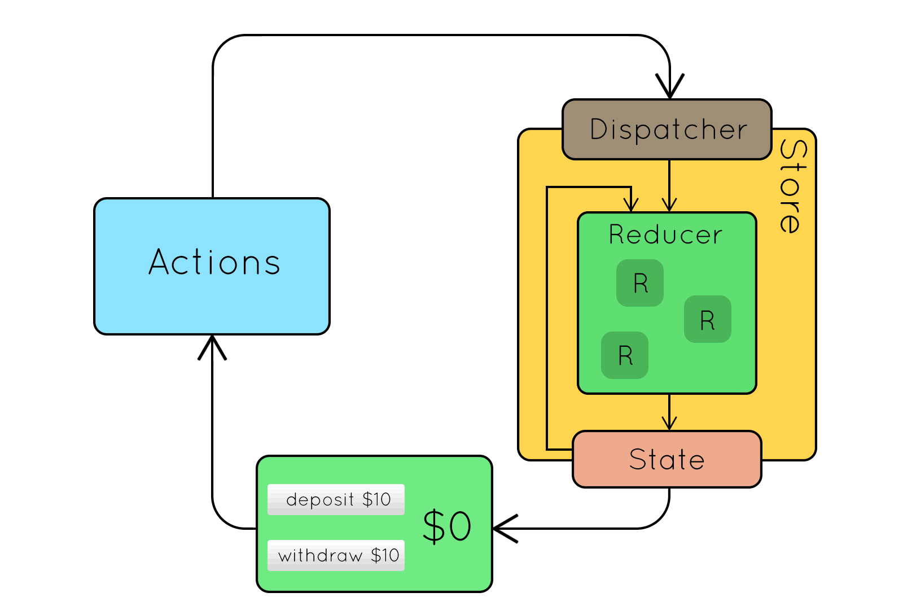
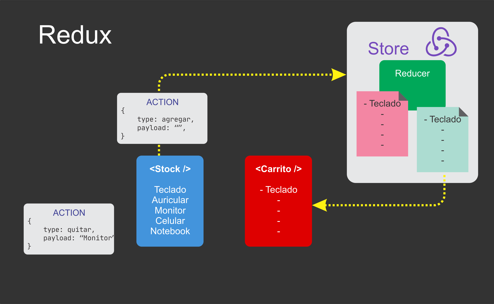

# M3-12 React Redux

[Volver a Inicio](../README.md)

## Links

- [Redux - Documentación](https://redux.js.org/)
- [Redux-Toolkit - Documentación](https://redux-toolkit.js.org/)
- [Fake Store API](https://fakestoreapi.com/)

## Funciones Puras

Una función pura es un concepto fundamental en programación funcional.
- Una función se considera pura si cumple con dos propiedades principales:
  1. Determinismo: Para los mismos argumentos de entrada, siempre devuelve el mismo resultado.
  2. Ausencia de efectos secundarios: No produce ningún efecto observable fuera de la función, como modificar una variable global, cambiar el estado de una estructura de datos mutable o realizar operaciones de entrada/salida (I/O).

- Ventajas de las Funciones Puras:
  1. Facilidad de prueba: Las funciones puras son más fáciles de probar porque su salida depende solo de sus entradas.
  2. Facilidad de comprensión: Son más fáciles de entender y razonar porque no tienen efectos secundarios.
  3. Paralelización: Las funciones puras son más fáciles de ejecutar en paralelo, ya que no dependen de ni modifican el estado compartido.
  4. Memoización: Las funciones puras son aptas para la memoización, un proceso de almacenamiento en caché de los resultados de las funciones para mejorar el rendimiento.

## Redux
Redux es una biblioteca de gestión de estado predecible para aplicaciones JavaScript, comúnmente utilizada con React.

### Conceptos Fundamentales

Store (Almacén):
- Es el objeto que contiene el estado de toda la aplicación.
- Es el único lugar donde se almacena el estado de la aplicación.
- Se crea usando la función createStore(reducer).

State (Estado):
- Representa el estado de la aplicación en un momento dado.
- Es un objeto inmutable que se puede actualizar solo mediante acciones.

Actions (Acciones):
- Son objetos que envían datos desde la aplicación hacia el store.
- Tienen al menos una propiedad type que indica el tipo de acción a realizar.
- Opcionalmente, pueden incluir otros datos necesarios para realizar la acción.

Reducers (Reductores):
- Son funciones puras que toman el estado actual y una acción, y devuelven un nuevo estado.
- Especifican cómo cambia el estado de la aplicación en respuesta a una acción enviada al store.

Dispatch (Despacho):
- Es una función disponible en el store que envía una acción al store para actualizar el estado.

Selectors (Selectores):
- Son funciones que seleccionan y devuelven una porción del estado desde el store.

