# M3-14 JavaScript Avanzado

[Volver a Inicio](../README.md)

## Algoritmos

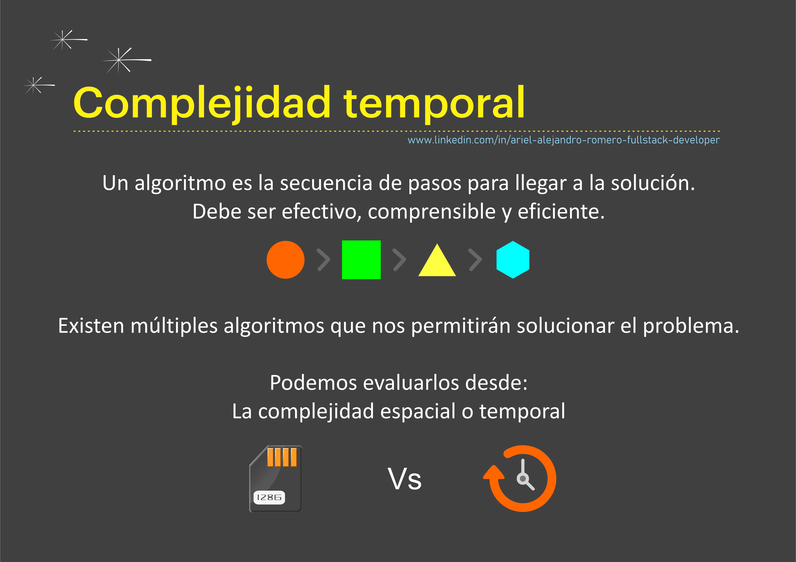

## Complejidad Temporal Vs Complejidad Espacial

> La complejidad temporal y la complejidad espacial son dos conceptos fundamentales en el análisis de algoritmos. A continuación, un resumen de cada uno de ellos:

### Complejidad Temporal

> La complejidad temporal se refiere a la cantidad de tiempo que un algoritmo tarda en ejecutarse en función del tamaño de la entrada. Esta se expresa generalmente usando la notación Big O, que proporciona una forma de describir el comportamiento de la función a medida que el tamaño de la entrada crece.

### Complejidad Espacial

> La complejidad espacial se refiere a la cantidad de memoria que un algoritmo necesita para ejecutarse en función del tamaño de la entrada. También se expresa usando la notación Big O.

## Formas de Crecimiento

### Crecimiento Constante

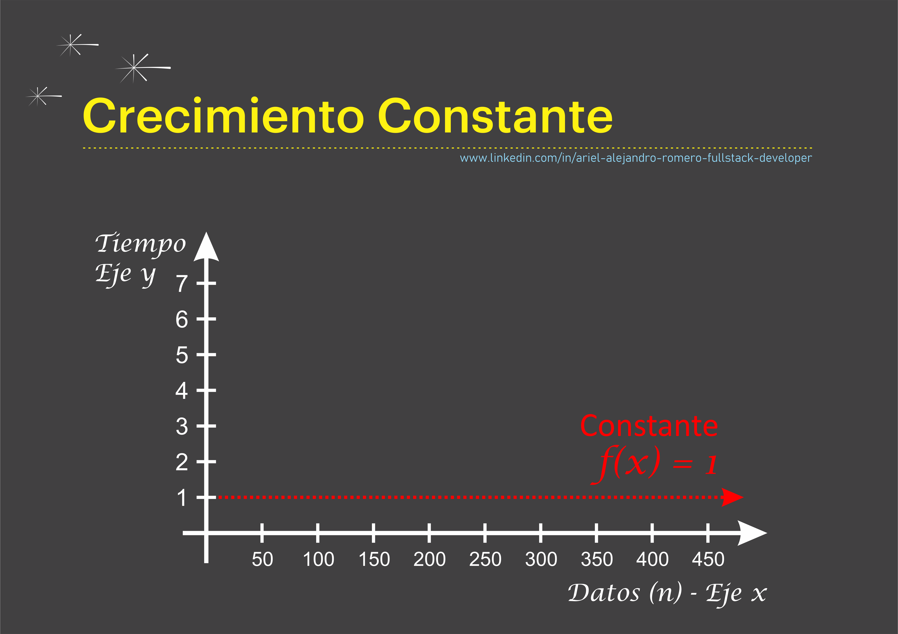

### Crecimiento Lineal

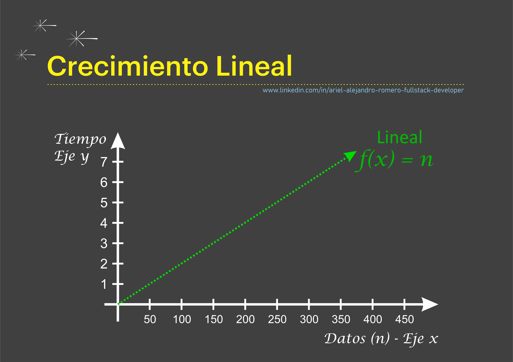

### Crecimiento Logarítmico

[Calculadora de Logaritmos en Base 2](https://www.omnicalculator.com/es/matematicas/log-2)

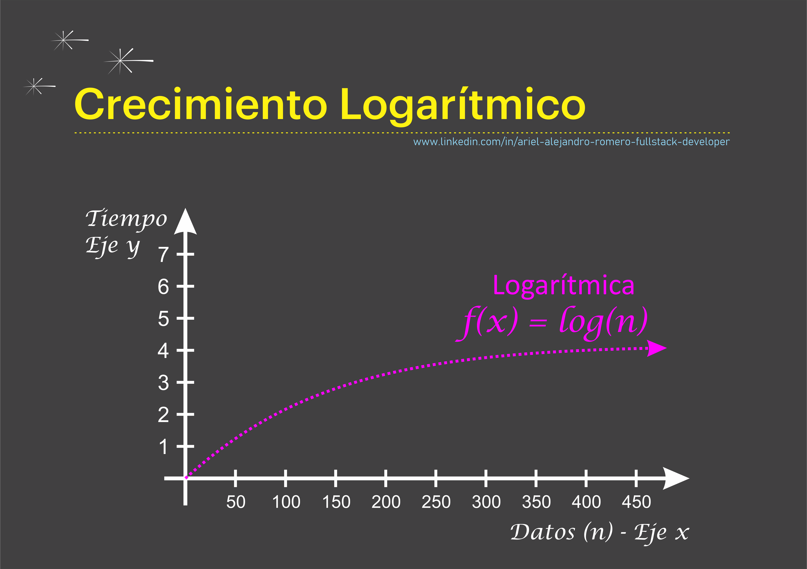

### Crecimiento Cuadrático

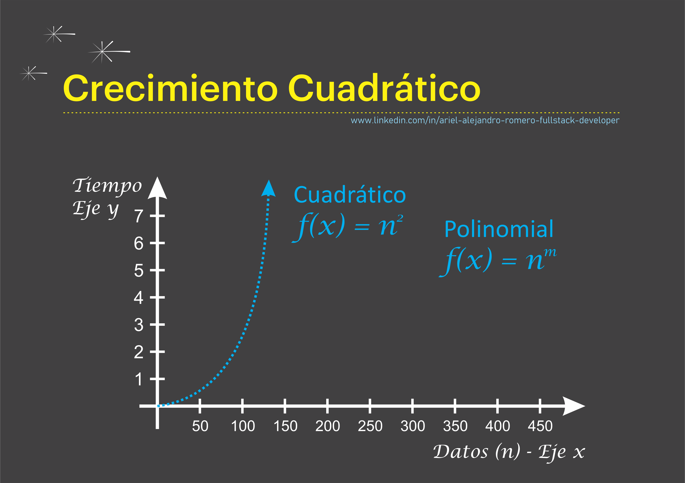

### Crecimiento Exponencial

[Video sobre doblar papel](https://www.youtube.com/shorts/35loZtGK38k)

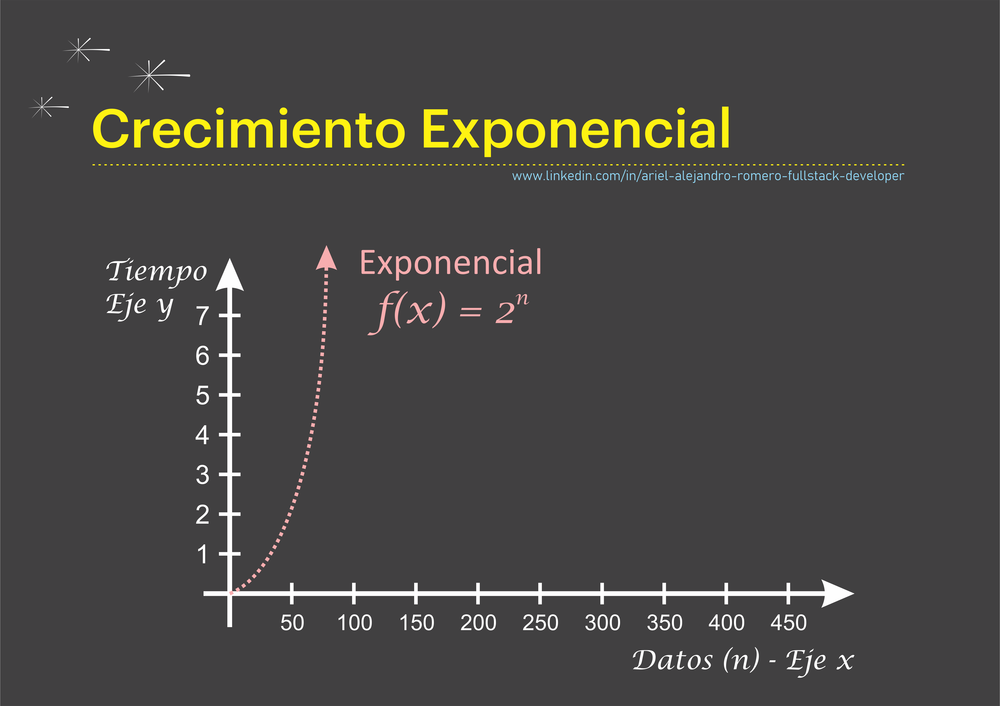

## Comparaciones entre las Formas de Crecimiento

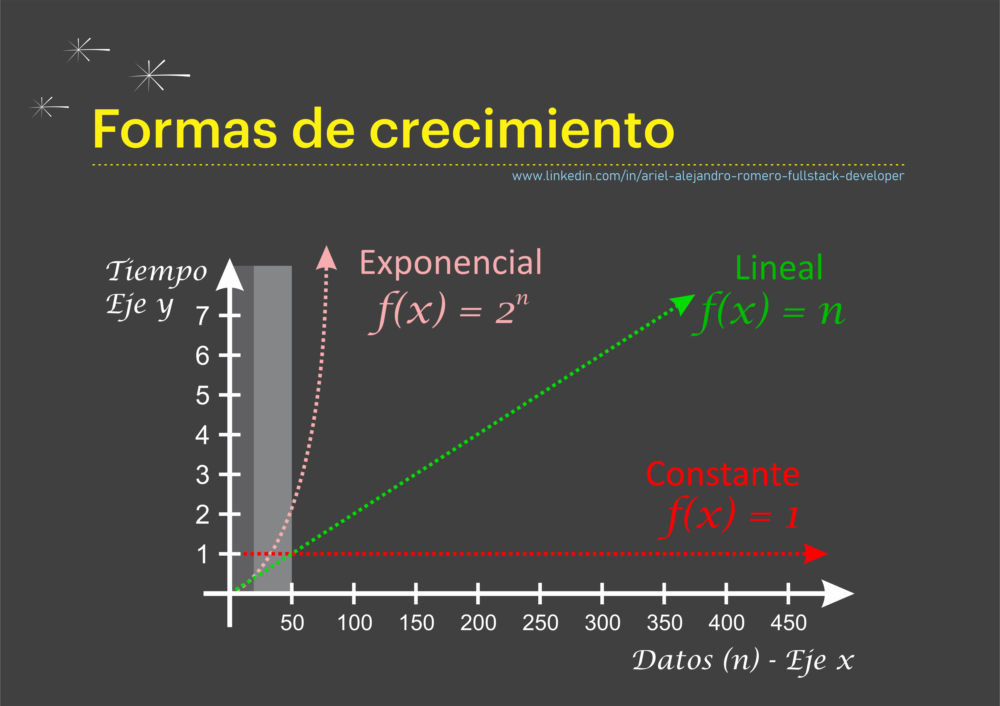

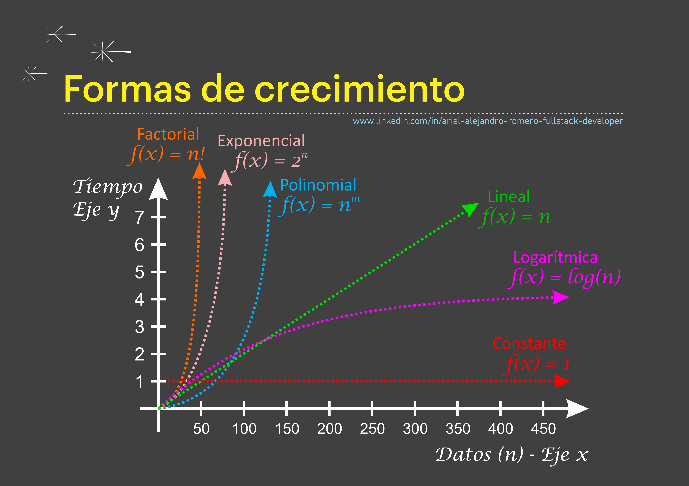

## ¿Qué es la Notación Asintótica o Big O?

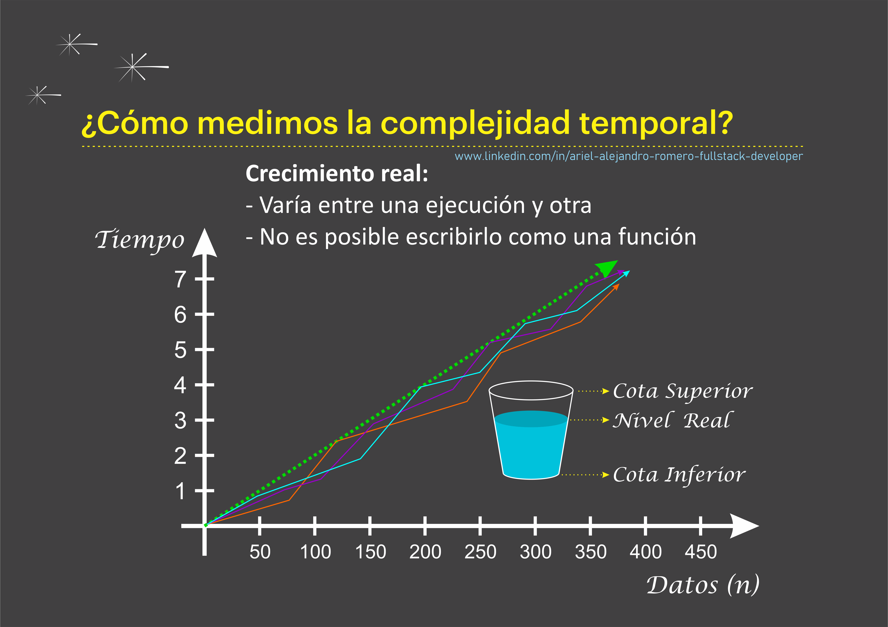

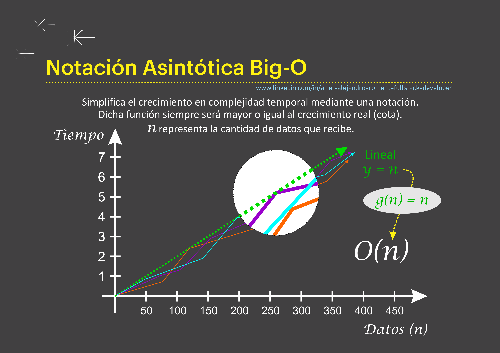

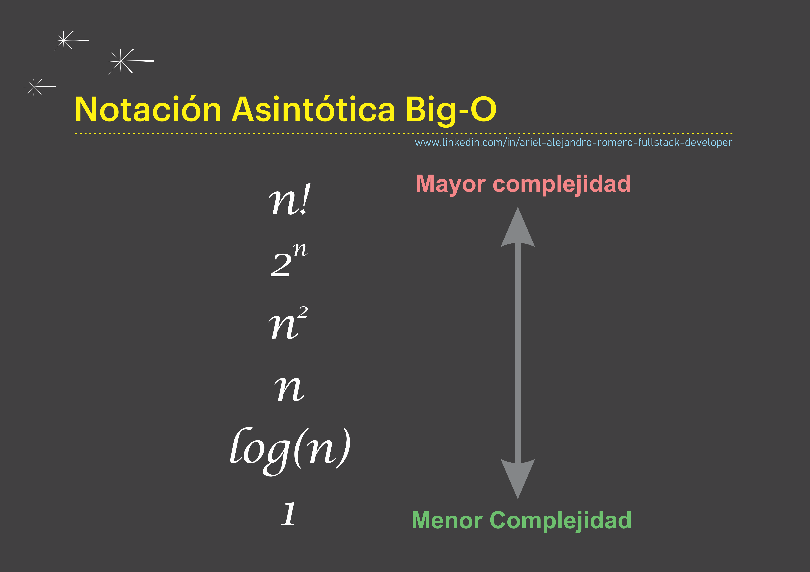

### Definición

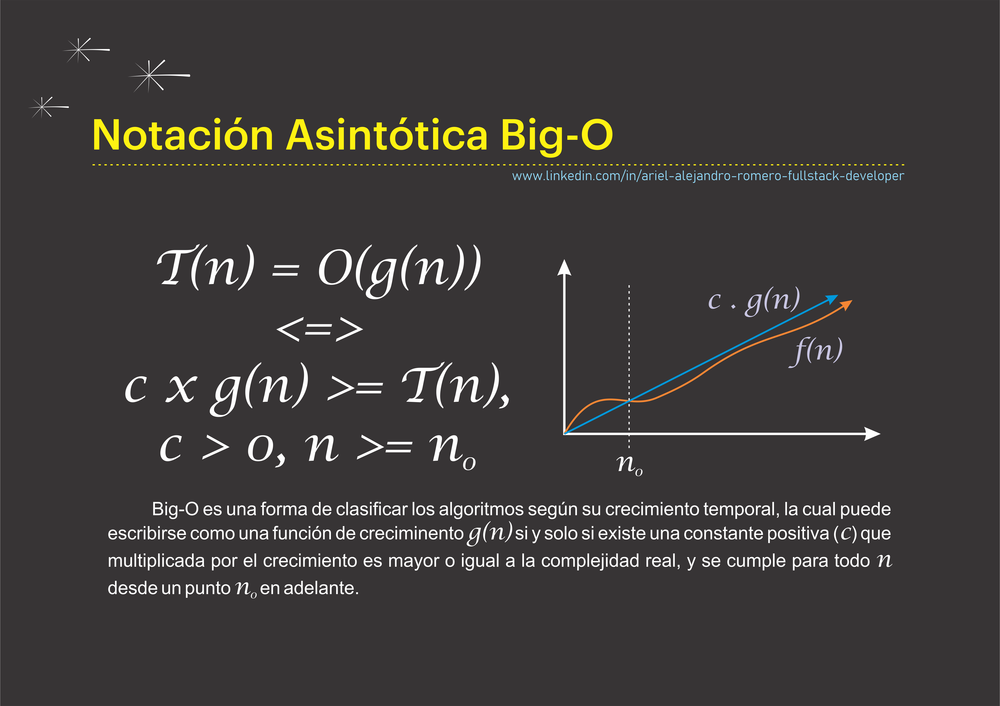